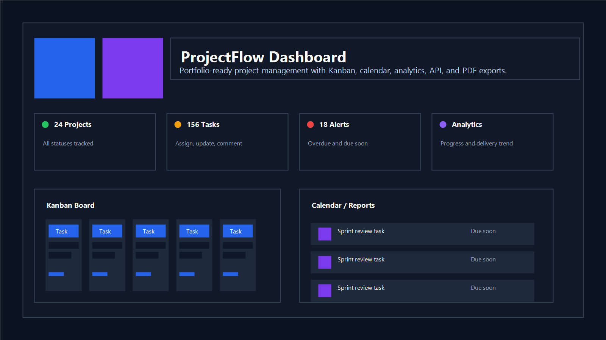

# ProjectFlow – Project Management Dashboard

An advanced **Project Management Dashboard** built using **Django, Python, HTML, CSS, and JavaScript**. The platform helps teams manage projects, tasks, deadlines, analytics, and productivity from a single dashboard.

---

## 🚀 Live Demo

**Live Website:**
https://project-management-dashboard-j8ih.onrender.com

---

## 📸 Screenshots

### Landing Page


### Dashboard



### Kanban Board


### Analytics Dashboard


### PDF Export


---

## ✨ Features

* User Authentication (Register/Login/Logout)
* Dashboard with KPI cards
* Project Management (CRUD)
* Task Management (CRUD)
* Kanban Board (Drag & Drop)
* Calendar View
* Analytics Dashboard
* Dark / Light Theme Toggle
* Notifications System
* Professional PDF Export
* Responsive UI

---

## 🛠 Tech Stack

### Backend

* Python
* Django 5.2

### Frontend

* HTML
* CSS
* JavaScript

### Database

* SQLite

### Analytics & Reporting

* Chart.js
* ReportLab
* Matplotlib

### Deployment

* Render

---

## 🏗 System Architecture

```text
User
   ↓
Frontend (HTML/CSS/JS)
   ↓
Django Views
   ↓
Models
   ↓
SQLite Database
```

---

## ⚙️ Installation

Clone repository:

```bash
git clone https://github.com/aishwaryagangaraj-web/project-management-dashboard.git
```

Move into project:

```bash
cd project-management-dashboard
```

Create virtual environment:

```bash
python -m venv .venv
```

Activate virtual environment:

Windows:

```bash
.\.venv\Scripts\activate
```

Install dependencies:

```bash
pip install -r requirements.txt
```

Run migrations:

```bash
python manage.py migrate
```

Run server:

```bash
python manage.py runserver
```

Open:

```text
http://127.0.0.1:8000/
```

---

## 📂 Folder Structure

```text
project_management_dashboard/
│── accounts/
│── analytics/
│── dashboard/
│── notifications/
│── projects/
│── reports/
│── tasks/
│── static/
│── templates/
│── media/
│── manage.py
│── requirements.txt
│── README.md
```

---

## 🔌 API Documentation

Planned REST APIs using Django REST Framework.

Future endpoints:

* /api/projects/
* /api/tasks/
* /api/analytics/

---

## 🚀 Future Enhancements

* Team Collaboration
* Email Notifications
* Role-Based Access
* AI Insights
* Real-Time Chat
* Task Comments
* File Uploads
* REST API Integration

---

## 👩‍💻 Author

**Aishwarya Gangaraj**

Python Developer | AI Enthusiast | Open Source Contributor

GitHub: https://github.com/aishwaryagangaraj-web

LinkedIn: https://linkedin.com/in/aishwarya-gangaraj-b7659328a
